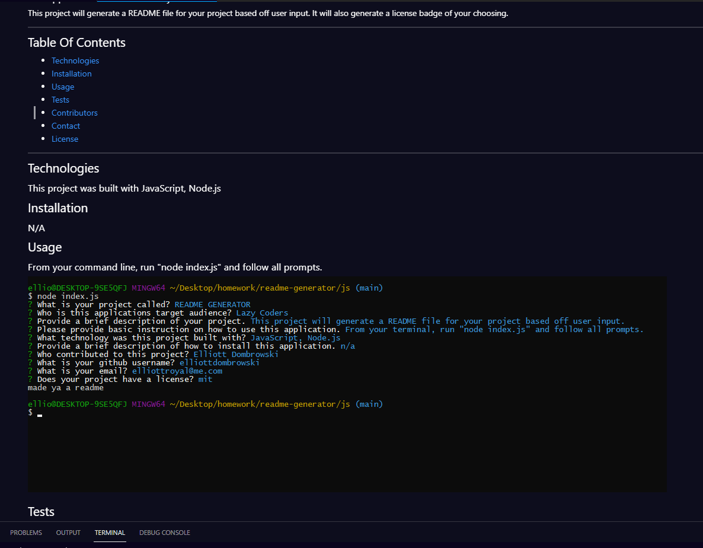

# README GENERATOR

## Description 

### This application was built for Lazy Coders. 
This project will generate a README file for your project based off user input. It will also generate a license badge of your choosing. 

---

## Table Of Contents
- [Technologies](#technologies)
- [Installation](#installation)
- [Usage](#usage)
- [Tests](#tests)
- [Contributors](#contributors)
- [Contact](#questions)
- [License](#license)

---

## Technologies 
### This project was built with JavaScript, Node.js 

## Installation 
### N/A 

## Usage
### From your command line, run "node index.js" and follow all prompts. 

---

## Tests
### There are currently no tests for this project. 

## License
### mit 
A short and simple permissive license with conditions only requiring preservation of copyright and license notices. Licensed works, modifications, and larger works may be distributed under different terms and without source code.

## Contributors 
### This application was built by Elliott Dombrowski 

## Questions
### Contact me with further questions here-
- [elliottdombrowski](https://github.com/elliottdombrowski)
- elliottroyal@me.com
